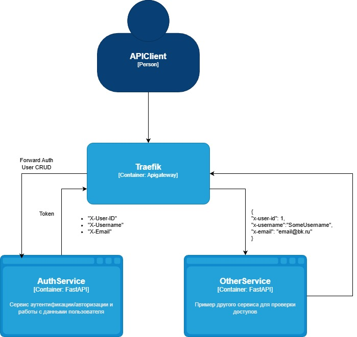

# Домашнее задание

В этом ДЗ вы научитесь добавлять в приложение аутентификацию и регистрацию пользователей.

Описание/Пошаговая инструкция выполнения домашнего задания:

## Вариант 1 (С КОДОМ)

Добавить в приложение аутентификацию и регистрацию пользователей.


Реализовать сценарий "Изменение и просмотр данных в профиле клиента".

Пользователь регистрируется. Заходит под собой и по определенному урлу получает данные о своем профиле. Может поменять данные в профиле. Данные профиля для чтения и редактирования не должны быть доступны другим клиентам (аутентифицированным или нет).


На выходе должны быть

0) описание архитектурного решения и схема взаимодействия сервисов (в виде картинки)
1) команда установки приложения (из helm-а или из манифестов). Обязательно указать в каком namespace нужно устанавливать.

команда установки api-gateway, если он отличен от nginx-ingress.
тесты постмана, которые прогоняют сценарий:
регистрация пользователя 1
проверка, что изменение и получение профиля пользователя недоступно без логина
вход пользователя 1
изменение профиля пользователя 1
проверка, что профиль поменялся
выход* (если есть)
регистрация пользователя 2
вход пользователя 2
проверка, что пользователь2 не имеет доступа на чтение и редактирование профиля пользователя1.

В тестах обязательно

наличие {{baseUrl}} для урла
использование домена arch.homework в качестве initial значения {{baseUrl}}
использование сгенерированных случайно данных в сценарии
отображение данных запроса и данных ответа при запуске из командной строки с помощью newman.

## Вариант 2 (БЕЗ КОДА)

Необходимо подготовить:

Диаграммы последовательности (сиквенс-диаграммы) реализующие сценарий аутентификации и следующий за ним ключевой сценарий из ДЗ1:

Сценарий 1. Пользователь не аутентифицирован, проходит аутентификацию и дальше идет переход на выполнение ключевого сценария.
Сценарий 2. Пользователь аутентифицирован, осуществляет попытку доступа к данным, которые ему не принадлежат или не доступны в виду ролевой модели.

Критерии оценки:
"Принято" - один из вариантов задания выполнен полностью (оба варианта выполнять не требуется)
"Возвращено на доработку" - задание не выполнено полностью


Компетенции:
Микросервисный подход проектирования ПО
- уметь применять паттерны аутентификации и авторизации в микросервисной архитектуре
Работа с проектированием взаимодействия сервисов
- уметь реализовать API Gateway

## Чек-лист

- [x] Сервис аутентификации 
- [x] Другой сервис
- [x] Тесты Postman
- [x] Схема взаимодействия сервисов
- [x] Команды для установки в Minikube

## Порядок применения манифестов


Порядок скорректирован через helm хуки

```shell
minikube image build -t auth-app:0.0.1 ./user-auth-service
minikube image build -t other-app:0.0.1 ./other-service

helm repo add traefik https://traefik.github.io/charts
helm repo update
helm install traefik traefik/traefik
kubectl apply -f .helm/traefik/

helm install postgres-database oci://registry-1.docker.io/bitnamicharts/postgresql -f ./.helm/values/postgres-values.yaml

helm install lection-23-release ./.helm -f ./.helm/values.yaml

minikube tunnel

echo "127.0.0.1 arch.homework" >> /etc/hosts

Добавить в C:\Windows\System32\drivers\etc\hosts  127.0.0.1 arch.homework
```

## Тестирование

```shell
newman run postman/lection-23.postman_collection.json -e postman/lection-23-environment.postman_environment.json 
```

Вывод
```
lection-23

→ 1. Регистрация пользователя 1
  POST http://arch.homework/auth/register [200 OK, 280B, 333ms]
  ✓  Status code is 200
  ✓  User created successfully
  ✓  User data matches request
  ✓  Response time is less than 500ms

→ 2. Попытка получить профиль без логина
  GET http://arch.homework/user/profile [401 Unauthorized, 191B, 7ms]
  ✓  Status code is 401 Unauthorized
  ✓  Response contains error detail

→ 3. Попытка обновить профиль без логина
  PUT http://arch.homework/user/profile [401 Unauthorized, 191B, 6ms]
  ✓  Status code is 401 Unauthorized
  ✓  Response contains error detail

→ 4. Вход пользователя 1
  POST http://arch.homework/auth/login [200 OK, 316B, 362ms]
  ✓  Status code is 200
  ✓  Token received
  ✓  Token is valid format
  ✓  Response time is less than 500ms

→ 5. Получение профиля пользователя 1 (авторизован)
  GET http://arch.homework/user/profile [200 OK, 280B, 8ms]
  ✓  Status code is 200
  ✓  Profile data is correct

→ 6. Обновление профиля пользователя 1
  PUT http://arch.homework/user/profile [200 OK, 167B, 327ms]
  ✓  Status code is 200
  ✓  Profile updated successfully

→ 7. Проверка что профиль изменился
  GET http://arch.homework/user/profile [200 OK, 293B, 8ms]
  ✓  Status code is 200
  ✓  Profile updated successfully

→ 8. Регистрация пользователя 2
  POST http://arch.homework/auth/register [200 OK, 280B, 343ms]
  ✓  Status code is 200
  ✓  User created successfully

→ 9. Вход пользователя 2
  POST http://arch.homework/auth/login [200 OK, 316B, 310ms]
  ✓  Status code is 200
  ✓  Token received

→ 10. Проверка доступа пользователя 2 к профилю пользователя 1
  GET http://arch.homework/user/32 [403 Forbidden, 181B, 10ms]
  ✓  Status code is 403 Forbidden
  ✓  Access denied message

→ 11. Проверка редактирования профиля пользователя 1 пользователем 2
  PUT http://arch.homework/user/32 [403 Forbidden, 181B, 10ms]
  ✓  Status code is 403 Forbidden
  ✓  Access denied message

┌─────────────────────────┬────────────────────┬───────────────────┐
│                         │           executed │            failed │
├─────────────────────────┼────────────────────┼───────────────────┤
│              iterations │                  1 │                 0 │
├─────────────────────────┼────────────────────┼───────────────────┤
│                requests │                 11 │                 0 │
├─────────────────────────┼────────────────────┼───────────────────┤
│            test-scripts │                 22 │                 0 │
├─────────────────────────┼────────────────────┼───────────────────┤
│      prerequest-scripts │                 14 │                 0 │
├─────────────────────────┼────────────────────┼───────────────────┤
│              assertions │                 26 │                 0 │
├─────────────────────────┴────────────────────┴───────────────────┤
│ total run duration: 2s                                           │
├──────────────────────────────────────────────────────────────────┤
│ total data received: 1.21kB (approx)                             │
├──────────────────────────────────────────────────────────────────┤
│ average response time: 156ms [min: 6ms, max: 362ms, s.d.: 163ms] │
└──────────────────────────────────────────────────────────────────┘
```


## Описание архитектурного решения и схема взаимодействия сервисов



# Источники

- https://github.com/vadim-perepelkin/gateway-demo